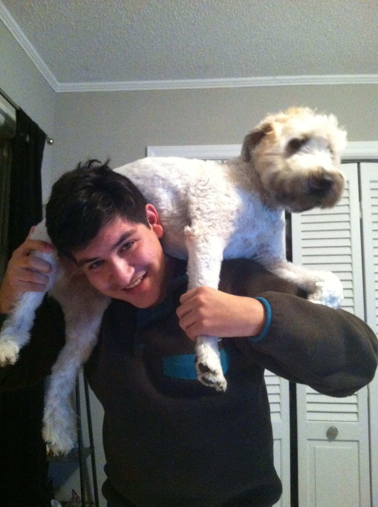

<figure>
  
  <figcaption>Walter</figcaption>
</figure>

Today I said goodbye to my best friend Walter. Or [as Arron Draplin puts it](http://www.draplin.com/2010/08/giving_gary_back_to_the_universe.html), I had to give him back to the universe.

Walter was diagnosed with a brain tumor in his brainstem. In a matter of months, Walter became worse and worse. Eventually getting to the point of not being able to stand without falling down. He was unable keep food and water down, resulting in him losing a lot of weight. Sandy and I made the decision to put him down before things got much worse. He was euthanized here in our apartment surrounded by the people that loved him. He was a few months shy of his 9th birthday.
